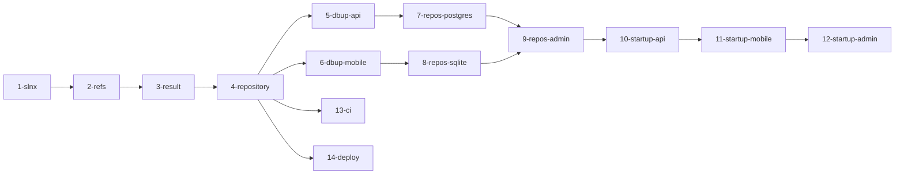

# Implementation Plan

## Overview

Scaffolding completo do monorepo ProvaVida: solução `.slnx`, 15 projetos em Clean Architecture, Result pattern, repositórios Dapper com base genérica, DbUp migrations (PostgreSQL e SQLite), DI e startup das 3 apps (API, Mobile MAUI, Admin Blazor) e workflows CI/CD via GitHub Actions.

## Tasks

- [ ] 1. Criar solução ProvaVida.slnx e estrutura de pastas
  - Criar o arquivo `ProvaVida.slnx` na raiz do repositório
  - Criar a estrutura de pastas: `src/Api/`, `src/Mobile/`, `src/Admin/`, `src/Shared/`, `tests/`
  - Criar todos os 15 projetos `.csproj` conforme tabela do design
  - Adicionar todos os projetos ao `.slnx`
  - Todos os projetos targeting `net10.0` (MAUI: `net10.0-android;net10.0-ios;net10.0-windows10.0.19041.0`)
  - Branch: `feature/fase-0-criar-solucao-slnx`
  - _Requirements: RF-01_

- [ ] 2. Configurar referências entre projetos (Clean Architecture)
  - Configurar `<ProjectReference>` em cada `.csproj` conforme diagrama de dependências do design
  - `Domain` sem referências de projeto; `Application` referencia `Domain` e `Shared`; `Infrastructure` referencia `Application` e `Domain`; `Web/App` referencia `Application` e `Infrastructure`
  - Branch: `feature/fase-0-referencias-clean-architecture`
  - _Requirements: RF-02_

- [ ] 3. Implementar Result e Result\<T\> no Shared
  - Criar `src/Shared/Common/Result.cs` com `Success`, `MessageErro`, `Ok()`, `Fail(string)`
  - Criar `src/Shared/Common/ResultT.cs` herdando de `Result` com `Data`, `Ok(T)`, `Fail(string)`
  - XML docs em ambas as classes
  - Testes TDD: `Result_Ok_DeveRetornarSuccessTrue`, `Result_Fail_DeveRetornarSuccessFalseComMensagem`, `ResultT_Ok_DeveRetornarSuccessTrueComDado`, `ResultT_Fail_DeveRetornarSuccessFalseSemDado`
  - Branch: `feature/fase-0-result-pattern`
  - _Requirements: RF-05_

- [ ] 4. Implementar IRepository\<T\> e DapperRepository\<T\> no Shared
  - Criar `IRepository.cs` com `GetByIdAsync`, `GetAllAsync`, `AddAsync`, `UpdateAsync`, `DeleteAsync`
  - Criar `DapperRepository.cs` como classe abstrata base com Dapper
  - Criar `IUsuarioRepository.cs` e `ICheckinRepository.cs` (interfaces vazias por ora)
  - XML docs em todas as interfaces e classe base
  - Branch: `feature/fase-0-repository-base`
  - _Requirements: RF-04_

- [ ] 5. Configurar DbUp + migrations iniciais para API (PostgreSQL)
  - Adicionar NuGet `DbUp-PostgreSQL` em `Api.Infrastructure`
  - Criar `DatabaseMigrator.cs` em `Api.Infrastructure/Data/`
  - Criar scripts `V001__criar_tabela_usuarios.sql` e `V002__criar_tabela_checkins.sql` como `EmbeddedResource`
  - Registrar execução das migrations no startup da API
  - Branch: `feature/fase-0-dbup-api-postgresql`
  - _Requirements: RF-03_

- [ ] 6. Configurar DbUp + migrations iniciais para Mobile (SQLite)
  - Adicionar NuGet `DbUp-SQLite` e `Microsoft.Data.Sqlite` em `Mobile.Infrastructure`
  - Criar `DatabaseMigrator.cs` em `Mobile.Infrastructure/Data/`
  - Criar scripts `V001__criar_tabela_usuarios.sql` e `V002__criar_tabela_checkins.sql` como `EmbeddedResource`
  - Caminho do SQLite via `FileSystem.AppDataDirectory`; registrar no startup do MAUI
  - Branch: `feature/fase-0-dbup-mobile-sqlite`
  - _Requirements: RF-03_

- [ ] 7. Implementar repositórios concretos PostgreSQL (API)
  - Criar entidades `Usuario` e `Checkin` em `Api.Domain` (POCOs puros, sem atributos de ORM)
  - Criar `PostgresUsuarioRepository.cs` e `PostgresCheckinRepository.cs` herdando `DapperRepository<T>`
  - Teste TDD: `PostgresUsuarioRepository_GetByIdAsync_DeveRetornarNull_QuandoNaoEncontrado`
  - Branch: `feature/fase-0-repositorios-postgres-api`
  - _Requirements: RF-04_

- [ ] 8. Implementar repositórios concretos SQLite (Mobile)
  - Criar entidades `Usuario` e `Checkin` em `Mobile.Domain` (POCOs puros)
  - Criar `SqliteUsuarioRepository.cs` e `SqliteCheckinRepository.cs` herdando `DapperRepository<T>`
  - Teste TDD: `SqliteUsuarioRepository_GetByIdAsync_DeveRetornarNull_QuandoNaoEncontrado`
  - Branch: `feature/fase-0-repositorios-sqlite-mobile`
  - _Requirements: RF-04_

- [ ] 9. Implementar repositórios Admin (PostgreSQL direto)
  - Criar `AdminUsuarioRepository.cs` implementando `IUsuarioRepository`, com `GetAllAsync` e `GetByIdAsync`
  - XML docs
  - Branch: `feature/fase-0-repositorios-admin`
  - _Requirements: RF-04_

- [ ] 10. Configurar DI e startup da API
  - Configurar `Program.cs`: `IDbConnection` → `NpgsqlConnection`, repositórios, DbUp, Scalar (`/scalar`), JWT middleware
  - `appsettings.json` sem secrets (apenas env vars); criar `global.json` com `sdk.version: "10.0"`
  - Branch: `feature/fase-0-di-startup-api`
  - _Requirements: RF-06, RF-08_

- [ ] 11. Configurar DI, resources e startup do Mobile (MAUI)
  - Configurar `MauiProgram.cs`: `IDbConnection` → `SqliteConnection`, repositórios, DbUp
  - Nome do app: "Enzojb Prova de Vida" (`ApplicationTitle` e `DisplayName` no `.csproj`)
  - Copiar resources de `docs/resources/`: ícones → `AppIcon/`, splash → `Splash/`, estilos → `Styles/`
  - Tela inicial placeholder (`ContentPage` vazio)
  - **E2E Manual (Windows):** app abre sem crash, banco SQLite criado com tabelas `usuarios` e `checkins`
  - Branch: `feature/fase-0-di-startup-mobile`
  - _Requirements: RF-06_

- [ ] 12. Configurar DI, Basic Auth e startup do Admin
  - Configurar `Program.cs`: `IDbConnection` → `NpgsqlConnection`, repositórios, HTTP Basic Auth (env vars `ADMIN_USUARIO` e `ADMIN_SENHA`), porta `5019`
  - Página inicial Blazor placeholder: "ProvaVida Admin — Em construção"
  - **E2E Manual:** credenciais corretas → placeholder; erradas → 401
  - Branch: `feature/fase-0-di-startup-admin`
  - _Requirements: RF-06, RF-09_

- [ ] 13. Criar workflow CI (GitHub Actions)
  - Criar `.github/workflows/ci.yml`; trigger: push em qualquer branch + pull_request
  - Passos: checkout → setup .NET 10 → restore → build → test (excluindo projetos MAUI)
  - Branch: `feature/fase-0-github-actions-ci`
  - _Requirements: RF-07_

- [ ] 14. Criar workflow Deploy API (GitHub Actions)
  - Criar `.github/workflows/deploy-api.yml`; trigger: push em `master`
  - Passos: checkout → setup .NET 10 → restore → build → test → publish → SCP para VM → restart `provavida-api` → health check
  - Secrets: `SSH_KEY`, `SSH_HOST`, `SSH_PORT`, `SSH_USER`
  - Branch: `feature/fase-0-github-actions-deploy`
  - _Requirements: RF-07_

## Task Dependency Graph

```json
{
  "waves": [
    { "wave": 1, "tasks": [1] },
    { "wave": 2, "tasks": [2] },
    { "wave": 3, "tasks": [3] },
    { "wave": 4, "tasks": [4, 13, 14] },
    { "wave": 5, "tasks": [5, 6] },
    { "wave": 6, "tasks": [7, 8] },
    { "wave": 7, "tasks": [9] },
    { "wave": 8, "tasks": [10] },
    { "wave": 9, "tasks": [11] },
    { "wave": 10, "tasks": [12] }
  ]
}
```



## Notes

- Branch padrão: `feature/fase-0-<descricao>` a partir de `dev-refatoracao`
- Critério global de conclusão por task: build passando + testes passando + PR aprovado
- Tasks com **E2E Manual** (11 e 12) requerem aprovação visual antes do PR
- Tasks 5 e 6 podem ser desenvolvidas em paralelo após a Task 4
- Tasks 7 e 8 podem ser desenvolvidas em paralelo após suas respectivas dependencies
- Tasks 13 e 14 podem ser feitas a qualquer momento após a Task 1
