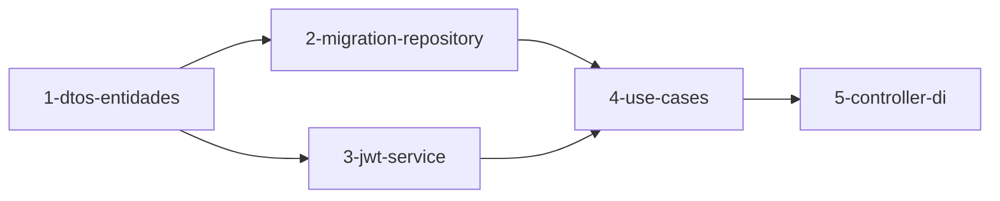

# Implementation Plan — Fase 1: Autenticação (API)

## Visão Geral

Implementar a autenticação na API do ProvaVida, abrangendo a entidade `RefreshToken`, migrations PostgreSQL para refresh tokens, DTOs no `Shared`, gerador de JWT e Refresh Token em `Api.Infrastructure`, use cases de cadastro, login, refresh e logout em `Api.Application`, e o controlador `AuthController` em `Api.Web`, acompanhado de cobertura de testes unitários.

---

## Tasks

- [ ] 1. Criar entidade `RefreshToken` e DTOs de Autenticação no `Shared`
  - Criar `src/Shared/Entities/RefreshToken.cs`
  - Criar DTOs em `src/Shared/Dtos/`: `RegisterRequest.cs`, `LoginRequest.cs`, `RefreshTokenRequest.cs`, `TokenResponse.cs`
  - Branch: `feature/fase-1-dtos-e-entidades`
  - _Requirements: RF-101, RF-102, RF-103, RF-104_

- [ ] 2. Criar migration PostgreSQL para tabela `refresh_tokens`
  - Criar `src/Api/ProvaVida.Api.Infrastructure/Migrations/V003__criar_tabela_refresh_tokens.sql` como EmbeddedResource
  - Criar interface `IRefreshTokenRepository` em `Api.Domain` e sua implementação `PostgresRefreshTokenRepository` em `Api.Infrastructure`
  - Branch: `feature/fase-1-migration-refresh-tokens`
  - _Requirements: RF-102, RF-103, RF-104_

- [ ] 3. Implementar `ITokenService` e `JwtTokenService` na API
  - Criar interface `ITokenService` em `Api.Domain`
  - Criar classe `JwtTokenService` em `Api.Infrastructure/Services/` gerando JWT Bearer signed com HMAC-SHA256 e Refresh Token randômico seguro
  - Testes TDD em `Api.Tests`: validar geração de claims e formato de tokens
  - Branch: `feature/fase-1-jwt-token-service`
  - _Requirements: RF-102, RF-103, RNF-102_

- [ ] 4. Implementar Use Cases de Autenticação em `Api.Application`
  - Implementar validators `CadastrarUsuarioValidator` e `LoginValidator` com FluentValidation
  - Implementar `AuthApplicationService` com os métodos: `RegisterAsync`, `LoginAsync`, `RefreshTokenAsync` e `LogoutAsync`
  - Testes TDD em `Api.Tests`: cobrir sucesso e falhas de cadastro duplicado, login inválido, refresh token expirado e logout
  - Branch: `feature/fase-1-use-cases-auth`
  - _Requirements: RF-101, RF-102, RF-103, RF-104, RNF-103, RNF-104_

- [ ] 5. Implementar `AuthController` e registrar DI na API
  - Criar `AuthController` em `Api.Web/Controllers/` com os endpoints `POST /auth/register`, `POST /auth/login`, `POST /auth/refresh` e `POST /auth/logout`
  - Registrar serviços e repositórios de auth no DI de `Api.Web/Program.cs`
  - Configurar middleware JWT Bearer em `Program.cs` para validar requisições autenticadas
  - Branch: `feature/fase-1-auth-controller-di`
  - _Requirements: RF-101, RF-102, RF-103, RF-104, RF-105_

---

## Dependency Graph

