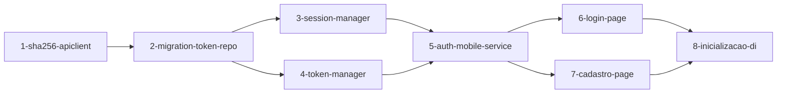

# Implementation Plan

## Overview

Implementar autenticação completa no app Mobile MAUI: hash SHA-256 local, ApiClient HTTP, repositório de tokens SQLite, use cases de auth, gerenciadores de sessão e token, telas de Login e Cadastro e fluxo de inicialização do app.

## Tasks

- [x] 1. Implementar `Sha256Helper` e `ApiClient` no Mobile
  - Criar `src/Mobile/ProvaVida.Mobile.Application/Utils/Sha256Helper.cs` — método estático `ComputeHash(string senha): string` usando `System.Security.Cryptography.SHA256`
  - Criar `src/Mobile/ProvaVida.Mobile.Infrastructure/Http/IApiClient.cs` e `ApiClient.cs` — wrapper de `HttpClient` com `PostAsync<TRequest, TResponse>` e base URL configurável via appsettings
  - Testes TDD: `Sha256Helper_DeveGerarHashCorreto`, `Sha256Helper_HashDeveSerDiferenteDaSenha`
  - Branch: `feature/fase-2-sha256-apiclient`
  - _Requirements: RF-201, RNF-201_

- [ ] 2. Criar migration SQLite V003 e `ITokenRepository`
  - Criar `src/Mobile/ProvaVida.Mobile.Infrastructure/Migrations/V003__adicionar_colunas_auth.sql` como `EmbeddedResource`
  - Criar `src/Mobile/ProvaVida.Mobile.Infrastructure/Repositories/ITokenRepository.cs` e `SqliteTokenRepository.cs` com: `SaveAsync`, `GetByUsuarioIdAsync`, `DeleteByUsuarioIdAsync`
  - XML docs em interface e classe
  - Testes TDD: `SqliteTokenRepository_SaveAsync_DevePersistirToken`, `SqliteTokenRepository_DeleteAsync_DeveRemoverToken`
  - Branch: `feature/fase-2-migration-token-repository`
  - _Requirements: RF-203, RF-204, RNF-203_

- [ ] 3. Implementar `ISessionManager` e `SessionManager`
  - Criar `src/Mobile/ProvaVida.Mobile.Application/Auth/ISessionManager.cs` e `SessionManager.cs`
  - Métodos: `IsLoggedInAsync()`, `GetCurrentUserAsync()`, `SaveSessionAsync(Usuario, string senhaHash)`, `ClearSessionAsync()`
  - `ClearSessionAsync` deve excluir dados de check-ins e do usuário do SQLite (conforme `Fluxo-Logoff.md`)
  - XML docs; testes TDD: `SessionManager_IsLoggedIn_DeveRetornarTrue_QuandoUsuarioExisteNoSqlite`, `SessionManager_ClearSession_DeveRemoverUsuarioECheckins`
  - Branch: `feature/fase-2-session-manager`
  - _Requirements: RF-204, RF-207_

- [ ] 4. Implementar `ITokenManager` e `TokenManager`
  - Criar `src/Mobile/ProvaVida.Mobile.Application/Auth/ITokenManager.cs` e `TokenManager.cs`
  - Métodos: `GetAccessTokenAsync()`, `RefreshTokenAsync()`, `SilentLoginAsync()`
  - Fluxo: token válido → retornar; expirado → refresh; refresh inválido → login silencioso com hash; falha → `ClearSession` + navegar para Login
  - XML docs; testes TDD cobrindo todos os 4 caminhos do fluxo
  - Branch: `feature/fase-2-token-manager`
  - _Requirements: RF-205_

- [ ] 5. Implementar `IAuthMobileService` e `AuthMobileService`
  - Criar `src/Mobile/ProvaVida.Mobile.Application/Auth/IAuthMobileService.cs` e `AuthMobileService.cs`
  - Métodos: `RegisterAsync(RegisterRequest)`, `LoginAsync(string email, string senha)`, `LogoutAsync()`
  - `LoginAsync`: gerar hash via `Sha256Helper` → chamar API → salvar `Usuario`, tokens e hash no SQLite via `SessionManager` e `TokenRepository`
  - `LogoutAsync`: chamar `POST /auth/logout` na API → `SessionManager.ClearSessionAsync()`
  - Validators com FluentValidation: `CadastrarUsuarioMobileValidator`, `LoginMobileValidator`
  - Testes TDD: cadastro sucesso/duplicado, login sucesso/inválido, logout
  - Branch: `feature/fase-2-auth-mobile-service`
  - _Requirements: RF-202, RF-203, RF-207, RNF-202_

- [ ] 6. Implementar `LoginPage` e `LoginViewModel`
  - Criar `src/Mobile/ProvaVida.Mobile.App/ViewModels/LoginViewModel.cs` com `ObservableProperty` para email, senha, isLoading, mensagemErro e `RelayCommand` para `LoginAsync` e `IrParaCadastroAsync`
  - Criar `src/Mobile/ProvaVida.Mobile.App/Pages/LoginPage.xaml` e `LoginPage.xaml.cs` com layout conforme referência visual em `origin/backup`
  - Validar conectividade antes de enviar
  - Branch: `feature/fase-2-login-page`
  - _Requirements: RF-203_

- [ ] 7. Implementar `CadastroPage` e `CadastroViewModel`
  - Criar `src/Mobile/ProvaVida.Mobile.App/ViewModels/CadastroViewModel.cs` com campos: nome, email, senha, confirmacaoSenha, whatsapp, contatoNome, contatoEmail, contatoWhatsapp, isLoading, mensagemErro e `RelayCommand` para `CadastrarAsync` e `VoltarParaLoginAsync`
  - Criar `src/Mobile/ProvaVida.Mobile.App/Pages/CadastroPage.xaml` e `CadastroPage.xaml.cs`
  - Validar conectividade e campos antes de enviar
  - Branch: `feature/fase-2-cadastro-page`
  - _Requirements: RF-202_

- [ ] 8. Implementar fluxo de inicialização e registrar DI
  - Atualizar `App.xaml.cs` com lógica de `OnStart` conforme `docs/Fluxo-Inicialização.md`: DbUp → usuário logado? → Check-in; senão → online? → Login; senão → erro + encerrar
  - Registrar no `MauiProgram.cs`: `IAuthMobileService`, `ISessionManager`, `ITokenManager`, `IApiClient`, `ITokenRepository`, ViewModels e Pages
  - Configurar `HttpClient` com base URL via appsettings (Development: `http://localhost:5001`; Produção: VM Oracle)
  - **E2E Manual (Windows):** app abre → sem usuário → Login; cadastro → sucesso → Login; login → sucesso → Check-in (placeholder); logoff → Login
  - Branch: `feature/fase-2-inicializacao-di`
  - _Requirements: RF-206, RF-207, RNF-206_

## Task Dependency Graph

```json
{
  "waves": [
    { "wave": 1, "tasks": [1] },
    { "wave": 2, "tasks": [2] },
    { "wave": 3, "tasks": [3, 4] },
    { "wave": 4, "tasks": [5] },
    { "wave": 5, "tasks": [6, 7] },
    { "wave": 6, "tasks": [8] }
  ]
}
```



## Notes

- Branch padrão: `feature/fase-2-<descricao>` a partir de `dev-refatoracao`
- Critério global de conclusão por task: build passando + testes passando + PR aprovado
- Task 8 requer **E2E Manual (Windows)** com aprovação visual antes do PR
- Base URL da API: Development = `http://localhost:5001` (WSL2); Produção = URL da VM Oracle via env var
- Referência visual de telas: branch `origin/backup` — manter consistência sem redesenhar do zero
- Tasks 3 e 4 podem ser desenvolvidas em paralelo após a Task 2
- Tasks 6 e 7 podem ser desenvolvidas em paralelo após a Task 5
